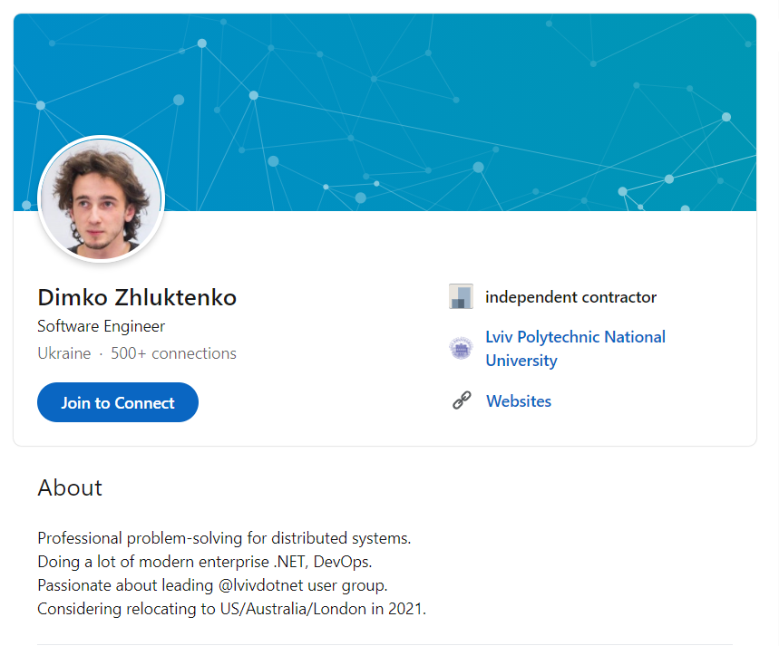

# LinkedIn2CV 

Automatically converts your LinkedIn profile into PDF CV overnight. Make the changes to your LinkedIn profile and it will get reflected in PDF so you only need to keep LinkedIn profile in sync! 

## LinkedIn

LinkedIn is a professional social network that is used for sourcing in software engineering world nowadays.
There you can fill up some fancy information about yourself - your experience, how long you are in the industry, what you are looking for, where did you study.

As you progress, the profile becomes outdated and it has to be updated.

## CV

CV is a document that briefly describes who you are, what you did, where did you study and so. You won't believe me, but in LinkedIn you can expose this information as well and let people apply search filters on your profile as well such as "give me everyone who studied in Boston in 2014-2018".

So, what is the process? You are looking for a job: actively (surfing through the internet, applying at company's website or so) or passively (just waiting for offers to appear). If you are doing the first way, then you will face the problem that most of the companies want to get your CV in the first place when you are applying for a job. And they want that CV as pdf, or docx, or any other fancy format.

Why would they need that? They want to know more about you to be sure whether you could potentially be a candidate for them or not - is there any sense in inviting you for an interview. Also, this document helps a lot people who are going to interview you since they are able to understand what you've been up to for some recent years. This really helps to prepare the right questions for you. However, not all the interviewers do that and that's bad though.

Only if there was a opportunity of sending them like a personal website with your CV in fancy HTML/CSS/JS... Oh wait, you actually should be allowed to do that because they are interested in the information, not in the fact that you have CV. And you can send your LinkedIn profile link which is actually your CV - it has all the information needed for recruiter/sourcer.

As you progress, CV also becomes outdated and it has to be updated.

## The solution

There is no point of keeping both things up to date at the same time. For that I propose a solution - to define a single source of truth and use that for printing - into pdf, docs, png, md - whatever one would need.
I use Linkedin as source of truth, then most of the times print it into PDF and send over.

### How it works

- Cron-job periodically queries LinkedIn API to fetch profile information
- Given profile information from LinkedIn, we can convert this data into desired format such as PDF.
- PDF is then pushed on corresponding GitHub repo.
